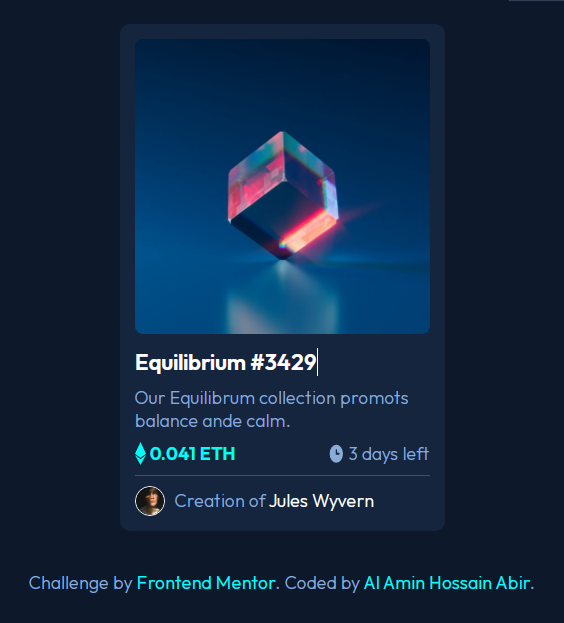

# Frontend Mentor - NFT preview card component solution

This is a solution to the [NFT preview card component challenge on Frontend Mentor](https://www.frontendmentor.io/challenges/nft-preview-card-component-SbdUL_w0U). Frontend Mentor challenges help you improve your coding skills by building realistic projects. 

## Table of contents

- [Overview](#overview)
  - [The challenge](#the-challenge)
  - [Screenshot](#screenshot)
  - [Links](#links)
- [My process](#my-process)
  - [Built with](#built-with)
  - [What I learned](#what-i-learned)
  - [Continued development](#continued-development)
  - [Useful resources](#useful-resources)
- [Author](#author)


**Note: Delete this note and update the table of contents based on what sections you keep.**

## Overview

This is my second Challenge of Frontend Mentor.

### The challenge

Users should be able to:

- View the optimal layout depending on their device's screen size
- See hover states for interactive elements

### Screenshot



### Links

- Solution URL: [Add solution URL here](https://your-solution-url.com)
- Live Site URL: [Add live site URL here](https://alaminhossain-nft-previe-card-component-fronendmentor.netlify.app/)

## My process
First I create html web page structure then css simple code and
hover effects

### Built with

- Semantic HTML5 markup
- CSS custom properties
- Flexbox


### What I learned

In this challenge i faced a problem that hover iffects on image to change image color.
Then I searced google and find a solve that is css filter property.

```html

```
```css
.card_image:hover{
    filter: opacity(0.5) drop-shadow(0 0 0 hsl(178, 100%, 50%));
    cursor: pointer;
    transition: 2sec;

}
```

### Continued development
I need to know more about some of the properties of CSS.
But I could solve css problem in a short time which i will face.

### Useful resources

- [How to write a good README for your GitHub project?](https://bulldogjob.com/readme/how-to-write-a-good-readme-for-your-github-project) - This helped me for XYZ reason. I really liked this pattern and will use it going forward.


## Author

- Website - [Al Amin Hossain Abir](http://mutaminnas.blogspot.com/)
- Frontend Mentor - [@Al-Amin-Hossain](https://www.frontendmentor.io/profile/Al-Amin-Hossain-32)
- Twitter - [Al Amin Hossain Abir](https://twitter.com/AlAminH30952334)


